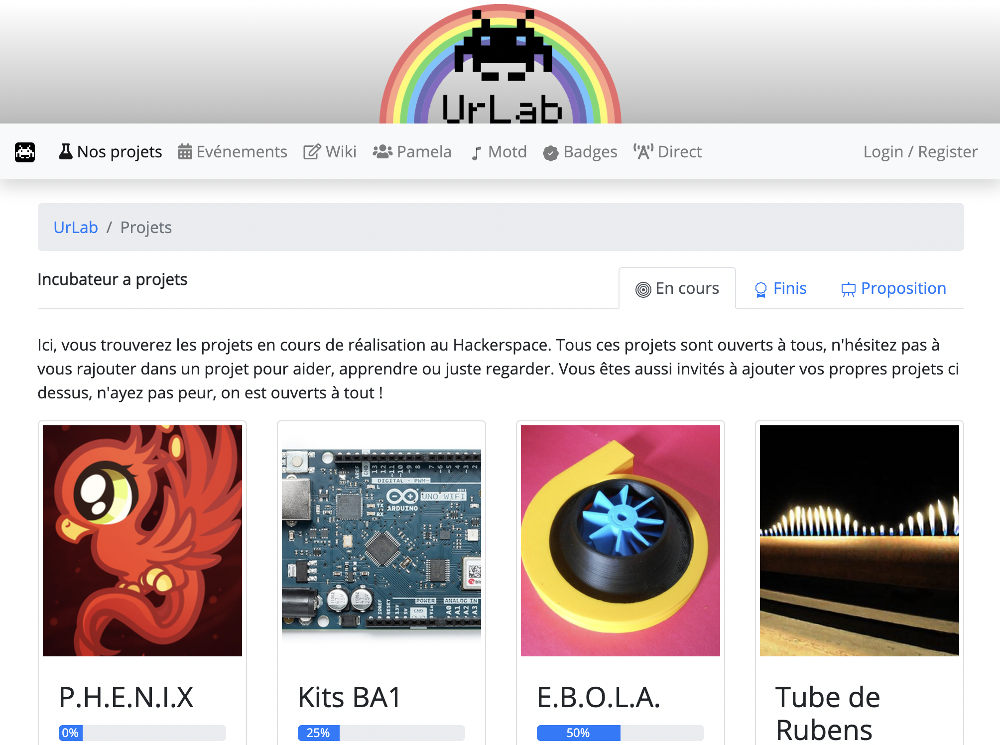

# UrLab incubator

The incubator is the main website of UrLab, a Hackerspace located in Brussels, Belgium.

A live instance can be found at [urlab.be](https://urlab.be).

# Features

The incubator has these main features:
 * Project showcase: members can pitch and present the projects they are working on at the hackerspace.
 * Event organisation: everybody can propose to organise an event and people can register their interest
 * Wiki: this speaks for itself
 * Ledger: members may pay for physical items (mostly food) at the space with a ledger on the website. This limits the amount of cash circulating in the hackerspace.
 * A [SpaceAPI](https://spaceapi.io/) implementation.

Bonus features are also available:
 * Live streaming of our online events (thank you Covid-19)
 * A list of our "music of the day"
 * Member badges
 * A newsletter

If you are a hackerspace and want to use this code, go ahead !

But please note that:
 * We did not implement a member handling system (no membership fee tracking, ...)
 * The code is quite coupled to UrLab and was not made to be generic
But if you want to have try, please do !

# Development guide

This is a typical Django project, the usual `virtualenv`, `requirements.txt`, ... apply.

Please have a look at [`DEVELOPMENT.md`](DEVELOPMENT.md) for an in-depth installation guide as well as help for common tasks.

# License

This code is under the AGPL licence. In broad, non legally binding, terms: you can do whatever you want with it, but if you modify it, you must redistribute the source and credit the original authors.

# History
The incubator is born from the frustration of our old website, a Mediawiki instance and was developed in a few days during the 2016 Brussels bombings lockdown. Here is a [quick brainstorming ](https://pad.lqdn.fr/p/incubator) we made at that time.
